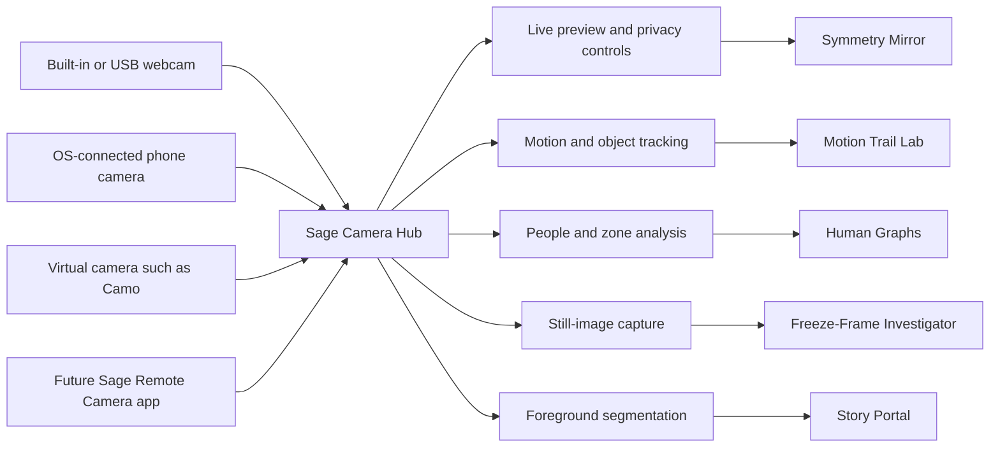

# Sage Stage — Camera Hub & Camera Learning Widgets

**Status:** Consolidated design — no implementation scheduled; spikes in §14
**Companion documents:** [Local Class Link design](collaboration-design.md) · [Class Link external relay reference](class-link-external-relay.md) · [Tangible Cubes](tangible-cubes-design.md) · [App review checklist](app-review-checklist.md)
**Date:** 2026-07-21
**Platform facts checked:** 2026-07-21 (Continuity Camera, Link to Windows connected camera, secure-context camera rules); verify again before implementation

---

## 1. What this is

The design for camera-based learning activities: five learning widgets built over one
shared **Sage Camera Hub**. The central decision is that every webcam, phone or tablet
becomes a **camera source** feeding the same hub — the learning widgets never care
whether the picture comes from a MacBook camera, USB webcam, iPhone, iPad or Android
phone.

Camera input inverts Class Link's networking problem. Class Link moves data
*device → network → board* and must fight staff/student VLANs and Wi-Fi client
isolation ([collaboration design §4](collaboration-design.md)). Camera activities move
data *paper/body → light → lens*, and every byte of processing happens on the teacher's
machine. The claim the external-relay reference says must never be made in hosted mode —
*"no student data leaves the classroom"* — is literally and verifiably true here, and
becomes the headline (§13).

## 2. Design principles

1. **Local-only processing.** All computer vision runs on the teacher's computer. No
   cloud video service, ever.
2. **Frames are transient.** Video frames live in memory only. Nothing is recorded;
   nothing is stored unless the teacher explicitly saves a still image or results.
3. **No identity.** No face recognition, no name matching from video, no tracking
   between lessons. Only derived data (points, masks, counts, trails) survives a frame.
4. **Cameras are interchangeable.** A widget consumes "the camera source"; the hub
   hides where the picture came from.
5. **Project abstractions, not children.** Where the pedagogy allows (Human Graphs),
   the projector shows dots and charts, not live video of the class.
6. **Honest numbers.** When confidence is poor, say "About 18 people detected" —
   never a fake-precise count.
7. **A widget first.** Each activity is a normal resizable Sage Stage widget, with a
   **Focus** control that temporarily presents it as a full-stage classroom activity.

## 3. The Sage Camera Hub

### 3.1 Hub responsibilities

- Camera selection, mirroring, rotation and resolution.
- **One exclusive stream, fanned out.** The hub owns a single system video stream per
  source and distributes frames to every consumer. This is a necessity, not a
  convenience: cameras — on Windows especially — are often exclusive-access, and two
  widgets opening the same device independently can fail. It also means camera
  permission is requested once, and a second camera widget never re-prompts.
- A large, unmistakable **"Camera live — processed on this device"** indicator
  whenever any camera is on.
- A compact **640×360 analysis stream** for computer vision, separate from a
  **720p/1080p presentation stream**, plus full-resolution still capture for
  Freeze-Frame Investigator (see the resolution reality in §4.6).
- **Performance modes** — Economy, Balanced and High Detail — selected automatically
  by a **first-run capability check**: a short hidden benchmark the first time a
  camera opens. Many school laptops are Celeron-class with 4 GB of RAM; a teacher
  should never need to know what segmentation costs. High Detail may also raise the
  analysis stream (e.g. 960×540) for small-object tracking.
- **Screen curtain.** Sage Stage *is* the projected surface, and most classrooms
  mirror the display. While a teacher configures a camera activity (calibration
  corners, quality preview, framing), the stage shows a curtain or countdown and the
  setup UI stays off the projector; classrooms with an extended desktop can show setup
  on the laptop panel instead. Without this, the class watches live video of
  themselves during setup — chaotic, and a privacy wobble. Every "teacher-only view"
  promised by a widget below rides this one mechanism.
- **Interruption handling.** Camera loss is a first-class event: freeze to the last
  safe frame or drop the curtain, then reconnect automatically when the source
  returns. (Continuity Camera drops when the iPhone takes a call — see §4.2.)
- **Camera health panel.** One shared place for framing help, exposure and backlight
  warnings, and the marker range check used by Motion Trail and Class Vote (§10).
- **Automatic camera shutdown** when no camera activity is running.
- **No recording and no stored frames** unless the teacher explicitly saves a still.

### 3.2 Non-goals in v1

- Two simultaneous cameras (e.g. document camera + performer camera). One active
  source at a time; a dual-camera case is parked as an open question (§15).
- Video recording of any kind. Stills only, by explicit teacher action.

### 3.3 Where camera widgets live in the UI — the Camera category

Six-plus camera widgets must not be scattered through the general "More" panel. The
toolbar already has the exact pattern needed: `TOOLS` entries carry a `cat` field,
`PANEL_TITLES` names each panel, and `catTab(...)` renders a permanent dock tab —
today for **Maths** and **Games**, which "keep growing" for the same reason camera
activities will. **Camera becomes the third category tab**, using the existing
`webcam` glyph.

That gives the feature a natural home and three free properties:

- Every camera activity is discoverable in one place, so a teacher who has bought a
  webcam finds everything it unlocks together.
- Camera widgets stay unpinned from the main bar by default, so nothing about the
  bar changes for teachers who never use a camera.
- The panel is the honest place for hub-level affordances: the camera chip (source
  selection), the camera health/range check, and a one-line privacy statement at the
  foot of the panel rather than repeated in six widgets.

**The existing `webcam` widget must migrate into this category and onto the hub.**
It currently calls `getUserMedia` directly and owns its own stream — precisely the
per-widget pattern §3.1 rules out, and it would conflict with any second camera
widget on exclusive-access hardware. It becomes the hub's simplest consumer: "show
me the camera", with mirroring, plus source selection it does not have today.

Two migration hazards to handle when that happens:

1. **Auto-start on load.** The widget persists `auto: true` after its first
   successful start, so a saved deck reopens with the camera starting by itself.
   Under the hub's consent model the camera should start only on an explicit action
   (or at minimum behind the live indicator and curtain), so this prop needs a
   deliberate migration decision rather than a straight port.
2. **Existing decks.** Saved widgets keep the `webcam` type id, so the migration must
   preserve that id — the same compatibility rule the Document widget already follows.

## 4. Connecting each kind of camera

### 4.1 Built-in or USB webcam — the universal baseline

The teacher:

1. Connects the webcam if it is external.
2. Adds one of the camera learning widgets.
3. Selects the camera from the widget's camera chip.
4. Grants camera permission the first time.
5. Uses the widget's framing and range check.

A USB document camera appears in exactly the same list as a webcam — Sage Stage does
not need separate "webcam" and "document camera" systems.

Technically, the desktop application requests the selected system video source. The
recommended default is 1280×720 at 30 fps, with analysis performed on a downscaled
copy. Requesting 4K would increase heat and processing without materially improving
most classroom activities.

### 4.2 iPhone → Mac (Continuity Camera)

The cleanest phone-camera experience, because Apple makes the iPhone appear as a
normal Mac camera.

The teacher:

1. Uses an iPhone XR or later running iOS 16 or later, and a Mac running macOS
   Ventura or later.
2. Signs both devices into the same Apple Account with two-factor authentication.
3. Enables Wi-Fi, Bluetooth and Continuity Camera.
4. Mounts the locked iPhone with its rear camera facing the activity.
5. Selects the iPhone from Sage Stage's camera selector.

It works wirelessly or over USB. USB is preferable for long lessons because it
charges the phone and is less susceptible to wireless interruption. Apple specifies a
working proximity of around ten metres.
([Apple's Continuity Camera requirements](https://support.apple.com/en-gb/102546))

Two operational notes:

- **An incoming call interrupts the feed.** The setup checklist should tell the
  teacher to enable Do Not Disturb; the hub's interruption handling (§3.1) covers the
  remainder.
- **Verify inside the Tauri build early.** Continuity Camera devices should enumerate
  like any system camera in the WKWebView, but this belongs to the §14 spike, not to
  assumption.

From Sage Stage's perspective, the iPhone is just another system camera. No special
version of the five widgets is required.

### 4.3 iPad → Mac

An important distinction: Apple does **not** currently expose an iPad as a continuous
Mac webcam through Continuity Camera. Apple supports using an iPad to insert a
photograph or scan into a Mac document, but its Mac-webcam feature is specifically
iPhone-based. ([Apple's Continuity feature matrix](https://support.apple.com/en-us/108046))

Three Sage Stage routes:

- **Immediate:** a third-party virtual-camera application such as Camo.
- **Later and preferred:** the native Sage Remote Camera companion app (§4.7).
- **Limited still-image use:** Apple's photo/scan handoff can feed Freeze-Frame
  Investigator, though it cannot support live activities.

AirPlay screen mirroring is not an adequate substitute: it sends the entire iPad
screen rather than presenting the camera as a clean source, and adds latency.

### 4.4 Android phone → Windows laptop

Windows 11 can expose a linked Android device as a connected camera.

The teacher:

1. Links the Android phone to Windows.
2. Opens **Settings → Bluetooth & devices → Mobile devices**.
3. Selects **Manage devices**.
4. Enables **Use as a connected camera**.
5. Selects that connected camera in Sage Stage.

Microsoft currently specifies Windows 11, Android 10 or later and a sufficiently
recent Link to Windows app; both devices need Wi-Fi.
([Microsoft's connected-camera guidance](https://support.microsoft.com/en-us/windows/apps/phonelink/manage-mobile-devices-in-windows))

**School-policy caveat:** Link to Windows requires Microsoft-account sign-in, which
school-managed Windows devices often block by policy — the same class of obstacle as
Camo's administrator requirement (§4.5). Check with the school's IT support before
recommending this pathway.

As with Continuity Camera, Sage Stage receives an ordinary camera source; all five
widgets work without knowing the camera is a phone.

### 4.5 iPhone → Windows laptop

Windows has no native equivalent of Continuity Camera for iPhone. The practical
immediate option is a virtual-camera product such as Camo:

1. Install Camo Studio on Windows.
2. Install the companion application on the iPhone.
3. Pair over USB or Wi-Fi.
4. Select "Camo Camera" inside Sage Stage.

Camo supports iPhone and Android connections to Windows and macOS, over USB or Wi-Fi,
and feeds any application that consumes ordinary camera sources.
([Camo compatibility and connection details](https://reincubate.com/support/camo/camo-faq/))

Disadvantages: extra installation, possible administrator restrictions on school
laptops, and dependence on a third-party product.

### 4.6 Still-image reality through OS camera paths

Through *any* OS webcam path — Continuity Camera, Link to Windows, Camo, or a USB
webcam — "highest practical still" means a **video frame**, typically 1080p-class,
not the phone's native 12 MP photograph. Freeze-Frame Investigator's capture and
magnifier must calibrate expectations accordingly (§8). True native-resolution stills
arrive only with the companion app (§4.7), which can take a real photograph on the
phone and deliver it alongside the stream.

### 4.7 The eventual universal option: Sage Remote Camera

A small Sage Remote Camera app for iPhone, iPad and Android would give one consistent
route across every platform.

The desktop application displays a pairing QR. The mobile app scans it and
establishes an encrypted local connection. The QR contains the teacher laptop's local
address, a temporary session identifier and a one-use pairing secret.

The connection would ideally use WebRTC:

- Video encoded efficiently by the phone.
- Media encrypted in transit.
- Pairing and signalling handled by the Sage Stage desktop application.
- No cloud video service.
- 720p at 15–30 fps as the normal classroom target.
- A separate high-resolution still-image request when needed (§4.6).
- Front/rear camera, torch, focus and exposure controlled from the teacher screen.

**Why not a simple camera web page?** A camera page served over ordinary classroom
HTTP is not sufficient: mobile browsers restrict camera access to secure contexts,
and `getUserMedia()` is unavailable on an insecure page opened from a local IP
address. ([MDN camera security requirements](https://developer.mozilla.org/en-US/docs/Web/API/MediaDevices/getUserMedia))
This finding rules out the "phone scanner page over plain LAN HTTP" idea from earlier
camera discussions.

A dependable Sage solution therefore needs one of:

- A native companion app — **the strongest long-term design**.
- A properly trusted HTTPS arrangement, which is impractical to provision on school
  LANs without browser warnings.
- A hosted HTTPS pairing page. Note the compromise is smaller than it first appears:
  with WebRTC, a hosted page affects **signalling only** — the video itself still
  travels peer-to-peer across the LAN and never leaves the room. That matches the
  "relay sees metadata, not content" posture of the
  [external relay reference](class-link-external-relay.md), and is an acceptable
  fallback if the native companion stalls — but it weakens the completely-local
  product story and is not the preferred route.

If school Wi-Fi isolates devices, the teacher can use a personal hotspot, or simply
choose an OS/USB camera pathway instead.

---

## 5. Motion Trail Lab

### Widget display

- A large live camera view.
- A coloured trail drawn behind the tracked object.
- Start, Pause, Freeze and Clear controls.
- A target selector: coloured object, bright marker, hand, or **printed marker
  sticker** (see technical behaviour).
- Trail duration: short, fading or complete journey.
- Optional distance, elapsed time, average speed and maximum speed.
- A small distance/time or speed/time graph.
- Calibration controls.
- A confidence indicator that warns when the object has been lost.

Presentation modes:

- **Simple:** only the object and trail.
- **Measure:** trail plus measurements.
- **Graph:** live camera beside a generated graph.
- **Predict:** children draw or select a predicted path before movement begins.

### Teacher setup

For a toy-car experiment, the teacher places the camera side-on and keeps it
stationary. A metre ruler or known-length calibration card is placed in the scene;
the teacher clicks its two ends and tells Sage Stage its real length.

The moving object receives a brightly coloured sticker or a printed marker sticker,
or is chosen with the onscreen colour sampler. The class predicts the path, and the
teacher releases the car.

Phone cameras are particularly useful because they can be placed low beside a ramp,
above a table or beside a playground activity. A built-in laptop camera is better for
hand movement and front-of-class demonstrations.

### Technical behaviour

The lightweight version uses colour tracking:

1. Convert each analysis frame into a colour space that separates colour from
   brightness.
2. Isolate pixels near the selected target colour.
3. Remove tiny regions caused by noise.
4. Find the centre of the largest credible target region.
5. Smooth the point sequence to prevent a jittery trail.
6. Use frame timestamps to calculate motion.
7. Convert pixels into centimetres using the calibration measurement.

**Marker target — the recommended robust alternative.** Colour tracking is at the
mercy of classroom lighting and white-balance shifts. A small printed ArUco-style
marker stuck to the object is nearly unkillable by comparison, gives orientation for
free (the trail can show which way the car pointed), and uses the **same detector as
Class Vote cards (§10)** — one vendored detector, two features. The colour sampler
remains for objects that cannot carry a sticker (balls in flight, hands).

If the object disappears, Sage Stage breaks the trail rather than drawing a false
jump across the image. A later perspective calibration using four marked floor or
tabletop points (the shared homography module, §11) allows accurate measurement when
the camera is angled.

Nothing except the derived points needs to be retained. If the teacher chooses "Keep
results," Sage Stage stores the path and measurements without storing any video.

### Learning uses

- Comparing toy-car speeds on different surfaces.
- Observing pendulum paths.
- Exploring straight, curved and irregular movement.
- Drawing letter or number shapes with a coloured wand.
- Following a ball's bounce.
- Comparing predicted and observed motion.
- Turning physical movement into distance/time graphs.

## 6. Human Graphs

### Widget display

Human Graphs normally projects an abstract graph rather than a room full of
identifiable faces.

Two views:

- **Setup view:** teacher-only camera preview with draggable boundaries (behind the
  screen curtain, §3.1).
- **Class view:** coloured dots, blocks or silhouettes positioned on a graph.

Graph modes:

- Bar chart.
- Number line.
- Two-circle Venn diagram.
- Four-quadrant chart.
- Coordinate grid.
- Opinion spectrum.
- Carroll diagram.

The teacher enters labels such as "Agree / Unsure / Disagree" or "Mammal / Not
mammal"; each region receives a large colour and icon. A live counter shows how many
people are confidently detected. A **Freeze graph** button locks the final
arrangement for discussion.

### Teacher setup

The camera should be raised and angled down enough to see the activity area. A phone
on a tripod at the front or side of the room usually provides a wider view than a
laptop camera.

The teacher marks the usable floor area by dragging four corners on the preview.
Sage Stage overlays the chosen graph divisions. **Projected regions need physical
counterparts on the floor** — the widget guides this with a "place a cone at each
flashing corner" step (cones, tape lines, or hoops for Venn circles), turning
calibration into a two-minute routine children can help with. Children then
physically place themselves according to their answer or data value.

For a number line, the teacher marks the two endpoints and assigns their values. For
a bar chart, the teacher defines the category lanes.

### Technical behaviour

Two detection levels:

**Basic occupancy mode** uses background and motion segmentation to determine how
much foreground activity is present inside each region. Robust and anonymous, but
approximate.

**Person-point mode** uses a local person detector to find one centre point per
visible person. Only the point and a confidence score survive the frame. There is no
face recognition, no name matching and no tracking between lessons.

**The clustering problem.** Children cluster: in bar-chart mode everyone stands in
the popular category, and that is precisely where person detection collapses into
merged blobs — the most popular answer is the least countable. Mitigations, in
order:

1. In bar-chart mode, children queue in lanes (teachers already run human bar charts
   this way), and the widget measures **occupied line length along each lane**
   through the floor homography — robust where head-counting is not.
2. Occupancy mode remains the default for dense arrangements.
3. Low confidence always degrades the display to honest language: "About 18 people
   detected", never an exact claim.

For an angled camera, the four-corner floor calibration is converted into a flattened
graph plane (shared homography module, §11), so a child at the far side of the room
is placed correctly on the projected graph rather than compressed by perspective.

### Learning uses

- Physically constructing bar charts from class preferences.
- Standing on a human number line for rounding or negative numbers.
- Venn diagrams for properties and classification.
- Agree/disagree continuums for debate.
- Coordinates and quadrants.
- Science classification.
- Geography scales and opinion mapping.
- Comparing the human graph with a conventional chart generated beside it.

## 7. Symmetry Mirror

### Widget display

A live camera view split by a bold movable axis. Modes:

- Vertical reflection.
- Horizontal reflection.
- Diagonal reflection.
- Quarter-turn rotation.
- Half-turn rotation.
- Four-way kaleidoscope.
- Silhouette-only mode.
- Freeze and annotate.

One side of the axis can be the real camera image while the other side is generated;
alternatively both sides remain live with a faint target outline that a child must
complete. The line of symmetry can be dragged and rotated. A grid and coordinate
labels can be added for older pupils.

### Teacher setup

For body symmetry, the camera faces one child or a pair, with the axis positioned
between them. For tabletop geometry, a phone or USB document camera points down at
blocks, pattern pieces, natural objects or artwork; the teacher places half a design
on one side of the line and pupils complete it physically on the other.

A built-in MacBook or Windows camera is sufficient for face, hand and whole-body
mirroring. A phone or iPad is preferable for overhead work.

### Technical behaviour

The basic version requires almost no computer vision: it crops one side of the frame,
reverses or rotates it, and composites the transformed image on the other side. These
are pure canvas transforms — **the cheapest build in the set** — and run smoothly on
modest school laptops, which is why Symmetry Mirror ships in the first batch (§14).

Optional silhouette mode introduces the shared segmentation module (§11), replacing
the room background with a plain colour so symmetry is easier to perceive and
classroom detail stays off the projector.

Freeze mode captures a still and hands it to the same annotation layer used by
Freeze-Frame Investigator (§11): children mark corresponding points, angles and
distances.

### Learning uses

- Body symmetry and asymmetry.
- Completing half-finished block patterns.
- Reflections in horizontal, vertical and diagonal lines.
- Rotational symmetry.
- Coordinates and transformations.
- Art and pattern design.
- Comparing symmetrical and non-symmetrical natural objects.
- Letter-shape investigations.

## 8. Freeze-Frame Investigator

An expanded document-camera widget built around observation — and quietly a
**visualiser replacement**: schools pay £100–500 for dedicated document cameras, and
this widget plus any camera the school already owns covers most of that ground. A USB
document camera still appears as an ordinary source (§4.1) for schools that have one.

### Widget display

Two deliberately different states.

**Live state**

- Large camera view.
- Capture button.
- Optional countdown.
- Grid, ruler or crosshair overlay.
- Focus and exposure status.

**Investigation state**

- Frozen high-resolution image.
- Pen, highlighter, arrow, shape, label and ruler tools.
- Magnifier.
- Count markers that automatically number themselves.
- Before/after comparison.
- Adjustable ghost overlay.
- Return to live view.
- Explicit **Save image** or **Keep on screen** controls.

The frozen frame remains independent of the live camera: the teacher can move the
phone or the object without losing the captured observation.

### Teacher setup

The teacher positions the camera above or in front of the subject: manipulatives, a
science demonstration, artwork, handwriting, plants, insects or a model.

For measurement, a ruler or calibration card sits in the same plane as the object, so
Sage Stage can convert onscreen distances into real units.

A phone's rear camera is ideal here. On a Mac, an iPhone operates through Continuity
Camera; an iPad or any phone through Camo or the future Sage companion; a USB
document camera remains the simplest permanent classroom setup.

### Technical behaviour

Live video remains 720p; pressing Capture requests the highest practical still frame.
**Resolution reality (§4.6):** through OS camera paths that is a ~1080p video frame,
not a phone-native photograph — the magnifier and any zoom UI must not promise
microscope-grade detail until the companion app can supply true high-resolution
stills.

Optional image processing:

- Automatic rotation.
- Four-corner perspective correction for a sheet of paper (shared homography module,
  §11).
- Contrast enhancement for faint writing.
- Before/after comparison with ghost overlay and difference highlighting —
  **fixed-mount features in v1.** With a stationary camera, alignment is free and the
  ghost overlay is trivial; automatically aligning handheld before/after shots is a
  research project and is deferred.
- Calibrated measurements.
- Numbered count markers.

The captured image is session-only. Saving it is a deliberate teacher action, because
a classroom frame might contain children (§13). Annotations belong to the captured
image, not the whole stage, and reuse Sage Stage's existing drawing concepts through
the shared annotation layer (§11).

### Learning uses

- Annotating a live science demonstration.
- Counting manipulatives.
- Magnifying minibeasts or plant structures.
- Comparing predictions with results.
- Examining handwriting or worked examples.
- Before/after chemical or physical changes.
- Measuring models and constructions.
- "What changed?" memory activities.

## 9. Story Portal

### Widget display

Story Portal composites children or objects over a chosen scene.

- A large finished stage rather than a technical camera preview.
- A scene strip: space, rainforest, castle, ocean, newsroom, historical street and
  custom images.
- Foreground placement and scale.
- Optional illustrated foreground props.
- Character-name captions.
- Speech or thought bubbles.
- Spotlight and freeze controls.
- **Save scene still** — a deliberate, teacher-only action with the same explicit-save
  gate as Freeze-Frame Investigator. EYFS settings live on evidence photographs for
  learning journals and will ask for this on day one; it is safer designed-in with the
  gate than bolted on later.
- A teacher-only quality indicator for background separation (behind the screen
  curtain, §3.1).
- A clear **"Live only — not recording"** message.

Scene modes: presenter, two-character conversation, news report, expedition diary,
museum guide, weather report, and object theatre for puppets or models.

### Teacher setup

The camera faces one child or a small group. Even lighting and a relatively plain
background improve separation. A green cloth produces the most dependable
low-powered result but is not mandatory.

The teacher chooses a scene, positions the performer and opens Focus mode. The child
performs directly on the projected Sage Stage screen.

A laptop camera works well for a seated presenter; a mounted phone gives better
quality and more flexible framing for standing performances.

### Technical behaviour

Two foreground-extraction methods:

**Chroma-key mode** removes a selected background colour. Lightweight, predictable,
works on older laptops. Include **green-spill suppression** — a small filter that
desaturates green fringing on hair and shoulders; it is cheap and accounts for most
of the perceived quality gap between "school green screen" and "TV green screen".

**Person-segmentation mode** uses a bundled on-device model to produce a foreground
mask, softened at the edges and combined with the chosen background. No identity or
facial recognition is involved.

The final image is assembled in layers:

1. Background scene.
2. Background props.
3. Live performer.
4. Foreground props.
5. Captions and speech bubbles.
6. Sage Stage controls and privacy indicator.

A sensible target is 720p at 24–30 fps. If the laptop cannot sustain that, Sage Stage
lowers segmentation resolution while keeping text and illustrated scenery sharp — the
capability check (§3.1) picks the starting point.

For a remote phone, the first implementation streams ordinary video to the laptop and
segments there. A later companion app could calculate the foreground mask on the
phone's neural hardware and send mask data alongside the video.

### Learning uses

- Retelling stories in role.
- Reporting from a historical event.
- Presenting from a geographical location.
- Performing dialogue in another language.
- Explaining a scientific process from "inside" the system.
- News reports and persuasive speaking.
- Puppet theatre and small-world storytelling.
- Describing settings, characters and atmosphere.

## 10. Class Vote cards

Originally sketched as a deferred sixth widget; **promoted on 2026-07-21 to the first
widget in the build order (§14)** — it is the flagship differentiator and the
teacher's stated priority. It is the only camera channel that gives **per-child,
assessment-grade** input without any student devices, and it shares infrastructure
this document already commits to.

Comparable products charge a recurring per-teacher subscription for this mechanic.
The mechanic itself is open — fiducial markers from academic robotics work and
classical computer vision — and runs entirely on the teacher's machine; the
subscription funds their cloud architecture (accounts, hosting, sync), not the
feature. Sage Stage's version has no account, no cloud and no recurring cost, and
keeps working offline forever. (Care with naming and artwork: the *mechanic* is
open, but "Plickers" is a trademark and its card designs are theirs — Sage Stage
generates its own ArUco card sets under its own name.)

- Each child holds a printed card carrying a fiducial marker (ArUco family — open and
  patent-free). A marker's ~6×6 grid is detectable at roughly three times the
  distance of a QR code of equal print size — the difference between scanning from
  the teacher's desk and having to walk each card to the camera.
- The marker encodes only a card number; **rotation encodes the answer** — the child
  turns their chosen answer to the top. Children cannot read each other's cards,
  which kills copying.
- Card packs print from the app, keyed to the linked class lists the picker/groups
  widgets already use (card 17 = named child), with a fully anonymous mode. Matte
  card stock (glossy bounces projector glare); an A4 "back-row pack" buys range.
- Scan UX: a "Show me your boards! 3… 2… 1…" countdown; a grid of card numbers
  lighting up as each child is spotted ("23 of 30 seen"); a debounce (orientation
  stable across ~10 consecutive frames); one vote per card, changeable until the
  teacher locks; then the reveal. Votes land in the existing poll widget's options,
  so tally, display and save behave identically to hand-tapped votes.
- Range guidance through the hub's camera health panel: built-in 720p ≈ 3–4 m with
  A5 cards; 1080p USB webcam on a tripod ≈ 6–7 m; phone cameras comfortably beyond.
- Shares the marker detector with Motion Trail Lab (§5) and the class lists and poll
  widget that already exist, so its marginal cost is card printing and scan UX.

## 11. Shared modules

Four pieces recur across widgets and are designed once, as hub-adjacent libraries:

| Module | Used by |
|---|---|
| **Homography** (four-point plane calibration) | Human Graphs floor plane (§6) · Freeze-Frame worksheet dewarp (§8) · Motion Trail perspective calibration (§5) |
| **Segmentation** (bundled person-mask model) | Story Portal (§9) · Symmetry Mirror silhouette mode (§7) |
| **Annotation layer** (pens, labels, rulers, count markers on a still) | Freeze-Frame (§8) · Symmetry Mirror freeze mode (§7) |
| **Marker detection** (ArUco-style) | Motion Trail sticker target (§5) · Class Vote cards (§10) · hub range check (§3.1) · [Tangible Cubes](tangible-cubes-design.md) |

Model payloads (segmentation, person detection) are **bundled locally and lazy-loaded
from disk** — the same self-hosting discipline as the font policy. Expect 5–30 MB per
model; no CDN, no first-run download.

## 12. Best camera source for each activity

| Widget | Built-in webcam | USB webcam/document camera | Mounted phone or tablet |
|---|---|---|---|
| Motion Trail Lab | Good for hands and body movement | Good when positioned side-on | Best for ramps, floors and unusual angles |
| Human Graphs | Limited by field of view | Good with a wide-angle webcam | Best overall classroom view |
| Symmetry Mirror | Excellent for individual body work | Excellent for tabletop work | Excellent overhead option |
| Freeze-Frame Investigator | Fair | Excellent document-camera experience | Excellent image quality and mobility |
| Story Portal | Excellent for a seated performer | Excellent for a fixed performance space | Best for full-body framing |

## 13. Safeguarding and privacy

Consolidated commitments, designed-in rather than promised:

- The camera is on **only** while a camera activity is open; a large live indicator
  is always visible; the hub shuts the camera down when nothing needs it.
- Frames are processed in memory, never stored and never transmitted. Only derived
  data — points, masks, counts, trails — survives a frame.
- No face recognition, no identification, no tracking between lessons. Person
  detection yields anonymous points.
- The screen curtain keeps live video off the projector during setup.
- Class-facing surfaces prefer abstractions (dots, charts, silhouettes) over live
  video wherever the pedagogy allows.
- Saving anything — a still, a composed scene, results — is a deliberate, labelled
  teacher action, stored through Sage Stage's normal local-first storage.

Appropriate product language:

> The camera works entirely on this computer. Pictures are never recorded, stored or
> sent anywhere — Sage Stage turns what the camera sees into dots, trails and charts,
> and forgets each picture immediately. It does not recognise faces or identify
> children. Nothing is kept unless you choose to save it.

Unlike hosted Class Link (external relay reference §11), the sentence **"no student
data leaves the classroom"** is literally true for every feature in this document,
and should be used prominently.

## 14. Build order and spikes

**Spike first — could force rearchitecting:**

1. Camera capture inside the Tauri v2 WKWebView on macOS: `NSCameraUsageDescription`,
   the camera entitlement, the permission-prompt plumbing, and Continuity Camera
   device enumeration. Confirm WebView2 on Windows sees USB and Link to Windows
   sources. Note: everything in this document also works in the plain browser build,
   so camera features need not wait for the Tauri migration.

**Then, in order:**

2. **Camera Hub core** — source selection, single-stream fan-out, live indicator,
   screen curtain, capability check, plus the **Camera category tab** and migration
   of the existing `webcam` widget onto the hub (§3.3).
3. **Class Vote cards** — first widget (decision 2026-07-21, §15 Q1: flagship
   differentiator and the teacher's priority). Ships the marker detector, card-pack
   printing keyed to class lists, and the scan UX feeding the existing poll widget.
   Classical CV only — no ML payload.
4. **Freeze-Frame Investigator + Symmetry Mirror** — no ML, fast wins; builds the
   annotation layer once.
5. **Motion Trail Lab** — colour + marker targets; inherits the Class Vote marker
   detector, so the remaining work is calibration UX, not computer vision.
6. **Human Graphs** — occupancy mode first; person-point mode later.
7. **Story Portal** — chroma key first; segmentation where the capability check
   allows.
8. **Sage Remote Camera companion** — last, and only if the OS pathways prove
   insufficient in real classrooms.

## 15. Open questions

1. ~~Where does Class Vote sit in the phasing?~~ **Resolved 2026-07-21:** promoted
   to first widget, directly after the Hub core (§14). It is the flagship
   differentiator — per-child, device-free voting with no account, no subscription
   and no cloud — and Motion Trail inherits its marker detector.
2. Story Portal scene art: commissioned or CC0, and how many scenes at launch? (Same
   licensing discipline as the font policy.)
3. Simultaneous dual camera (document camera + performer camera) — is there a real
   v2 case?
4. Should Focus mode pause other widgets' rendering to reclaim performance on weak
   laptops?
5. Is 5–30 MB per bundled model acceptable in the installer, or downloaded on first
   need from Sage Stage's own site (which weakens offline-first)?
6. How common are mirrored vs extended-desktop classrooms in practice — how much work
   must the screen curtain do?
7. The companion app: is the iOS + Android build, signing and maintenance overhead
   justified, and what is the decision gate for starting it?

## 16. Notes for future camera widgets

An appendix for widget seven onwards. Everything here lands in the **Camera category**
(§3.3) alongside the existing set.

### 16.1 The hub contract

Any new camera widget inherits, and must not re-implement:

- **The stream.** Subscribe to the hub's analysis or presentation stream. Never call
  `getUserMedia` directly — that breaks exclusive-access hardware and duplicates the
  permission prompt.
- **Consent and indicator.** The live indicator, auto-shutdown and interruption
  handling are hub-level and automatic.
- **The screen curtain.** Any setup UI that shows live video belongs behind it.
- **Performance mode.** Honour Economy/Balanced/High Detail from the capability
  check; degrade resolution or frame rate rather than dropping frames raggedly.
- **The four shared modules** (§11) before writing new computer vision.

And must satisfy, by design rather than by promise:

- Frames stay transient; only derived data persists.
- Saving anything is a deliberate, labelled teacher action.
- Nothing identifies a child.
- Confidence is reported honestly ("about 18") when detection is approximate.

### 16.2 Parked ideas — the EYFS/KS1 movement tier

The five widgets plus Class Vote skew towards KS1–KS2. A whole-body, front-of-class
tier for Early Years remains the biggest gap, and splits by cost:

**Tier 0 — no ML, frame differencing only.** Motion energy per region of the view is
cheap, robust with thirty reception children in poor light, and needs no bundled
model:

- **Wiggle-o-meter** — motion energy drives a bar or creature; brain breaks and
  energy games.
- **Statue / freeze game** — stillness fills a bar; the class must hold steady
  together.
- **Zone voting** — 2–4 floor zones, "stand under the apple if you think it floats";
  the fullest zone wins. This is Human Graphs' occupancy mode (§6) with a game
  wrapper, so most of the work is already committed.

Highest delight-per-line-of-code in the whole document; worth doing before any
model-based work.

**Tier 1 — bundled on-device models** (same licensing and self-hosting discipline as
§11, no CDN):

- **Gesture voting** — thumbs up/down/sideways for small groups; complements Class
  Vote cards where cards are overkill.
- **Face-landmark games** — landmarks only, no identity: open your mouth to pop the
  bubble, smile to start, tilt your head to steer or choose. Ideal for pre-readers.
- **Pose games** — "make a star shape", "copy the letter with your body".

**The honest limit:** webcam skeleton and face tracking handles roughly four to six
people on school laptops, not a whole class. So whole-class activities must stay
Tier 0 (zones and motion), and skeleton or face games should be framed as
front-of-class turns — which is developmentally right for EYFS anyway. Do not design
an activity whose fun depends on tracking thirty children at once.

### 16.3 Other parked ideas

- **Live document-camera annotation** — annotating the *moving* image rather than a
  frozen one; a natural Freeze-Frame sibling once the annotation layer exists.
- **Colour/shape sorting checker** — point the camera at sorted objects for a "what
  did you sort by?" discussion; shares Motion Trail's colour sampler.
- **Card-based ordering and sequencing** — Class Vote's marker detector reused for
  "hold up the cards in the right order" rather than voting, giving sequencing,
  place value and phoneme activities without new detection work. **Developed into a
  full concept in [Tangible Cubes](tangible-cubes-design.md)** (2026-07-22), which
  takes the same detector to printed cubes children compose with on a table. Note it
  sits at the *opposite* tempo to Class Vote — slow, small-group, no countdown — and
  deliberately ignores rotation, which Class Vote uses as its answer channel.

### 16.4 When the Camera panel gets crowded

Maths already demonstrates the ceiling: past roughly a dozen entries a flat grid
becomes hard to scan. If the Camera category passes that, group inside the panel by
purpose — *Respond* (Class Vote, gesture and zone voting), *Investigate*
(Freeze-Frame, Motion Trail, Symmetry), *Perform* (Story Portal) — before considering
a second dock tab. One tab, grouped, beats two tabs a teacher has to choose between.
