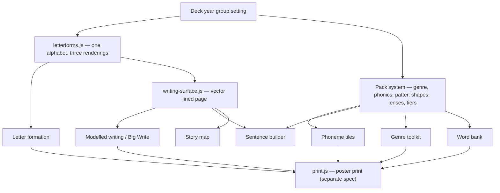

# Sage Stage — English & Literacy Widgets

**Status:** Approved design (brainstormed and agreed 2026-07-22) — no code yet. The
poster print engine is a **separate spec —
[poster-print-design.md](poster-print-design.md) (2026-07-25)**; its seam with this
set is fixed in §4.5 so both specs build to the same joint.
**Companion documents:** [Maths manipulatives roadmap](maths-manipulatives-top10.md) ·
[App review checklist](app-review-checklist.md) ·
[Camera Hub design](camera-hub-design.md) ·
[Storage abstraction plan](storage-abstraction-plan.md) ·
[Iteration log](iteration-log.md)
**Date:** 2026-07-22
**Research base:** teacher-supplied survey of UK primary literacy practice
(2026-07-22); primary sources in §17. Pedagogical claims in this doc trace to those
sources, not to memory.

---

## 1. What this is

The design for Sage Stage's English set: **ten widgets on four shared engines**,
spanning Reception to Year 6. The set is organised by the **grain of language** a
widget manipulates — Sound → Word → Sentence → Text — the direct analogue of the
maths manipulatives: each widget is the concrete, draggable object at its grain,
exactly as counters and Base 10 blocks are at theirs.

The two sets differ in where their output lands. Maths widgets put manipulatives
**on the screen**; English widgets put a **working wall on the wall**. UK primary
English classrooms run on evolving working walls — vocabulary cards, annotated
modelled writing, genre checklists that grow daily during lessons — and nearly every
widget here prints something a working wall wants. That is why the poster print
engine and this set arrive together, and why every printable surface in this design
is vector end-to-end.

English is also not "a subject" the way the camera widgets serve one: transcription
and composition thread through science write-ups, history recounts and RE
reflections. The cross-curricular hooks are designed in from the start (§13), not
retrofitted.

## 2. Design principles

1. **The grain spine.** Sound → Word → Sentence → Text. A widget is the manipulable
   object at its grain; a year group's centre of gravity moves along the spine as
   children grow (§3.4). One set serves Reception to Year 6 — never two parallel
   sets that strand Year 2/3.
2. **Transcription before composition.** Spelling and handwriting must become
   automatic so working memory is free for composing. The build order follows the
   science: Sound and Word engines first.
3. **Fidelity through packs.** Schools run their chosen schemes *with fidelity* —
   an RWI school cannot use a widget hard-coded to Little Wandle's teaching order.
   Every scheme-shaped asset (GPC sequences, formation patter, sentence-shape
   names, focus lenses, tier labels, genre toolkits) is **data in a school-editable
   pack**, never code.
4. **Neutral by default, editable by school.** Defaults are our own wording or
   Crown-copyright material under OGL. Branded scheme content (Jolly Phonics
   actions, RWI rhymes, Considine lenses, Peat sentence names) is never shipped —
   schools that license those schemes type the wording into their own packs (§11).
5. **The wall is the output.** Every widget answers "what does this print?" —
   sound mats, alphabet friezes, word cards, shape posters, modelled pages, genre
   checklists. Poster print (§4.5) is how they get there at display size.
6. **The teacher voices the sounds.** No recorded audio in v1. Phonics lives on
   pure sounds (/m/ never "muh") and the teacher is the model; the widgets provide
   the visuals and the timing, not a voice.
7. **One surface, one alphabet.** A single vector writing surface under everything
   that holds writing; a single letterform data set rendered three ways (print,
   pre-cursive, joined). No duplicated engines.
8. **The maths manipulative grammar.** Tap the tray to add, drag to move, drop on
   the bin to remove; Flash and Cover for recall; "?" masking on anything that
   shows an answer; everything scales with the widget. Teachers who know the maths
   set already know how this one handles.
9. **Widget first, Focus for whole-class moments.** As in the camera design: each
   activity is a normal resizable widget, with a Focus control when it should own
   the room (Big Write).
10. **Local-only, as ever.** No cloud services, no accounts, no pupil data leaving
    the machine. Packs travel over the existing static-host template rail.

## 3. Research grounding — why the set is shaped this way

### 3.1 Cognitive load sets the build order

Writing is not a natural adaptation; it is a culturally acquired system built on
finite working memory. Until transcription (spelling + handwriting) is automatic,
the mechanics consume the capacity a child needs for planning, word choice and
sentence construction. This is the pedagogical justification for the spine and for
building the Sound/Word engines before the Text ones: the set's EYFS/KS1 half
exists to *automate transcription*, its KS2 half to *spend the freed capacity on
composition*.

### 3.2 Programme fidelity makes packs adoption-critical

Systematic Synthetic Phonics programmes (Read Write Inc., Little Wandle, and
successors to Letters and Sounds) are taught daily, in programme order, with strict
fidelity — schools are inspected on it. GPC teaching order, mnemonic rhymes and
terminology differ between programmes. A phonics widget with a baked-in order is
therefore *unusable* in schools running a different programme — not suboptimal,
unusable. Pack-editability (§4.4) is what makes one widget serve every school; it
is the English set's equivalent of the maths set's "every chart from T·O to
Millions" range decision.

### 3.3 The working wall is the unifying output

Working walls start nearly blank and grow daily; to stay honest, anything displayed
must have been created *during lessons with the class* — vocabulary cards from
harvest moments, modelled writing annotated live, success criteria revealed as
taught. That maps one-to-one onto widget outputs: word bank cards, modelled pages,
genre toolkit posters. The print pipeline is not a convenience feature; it is how
screen work becomes the classroom's permanent scaffolding.

### 3.4 Where each year group lives on the spine

| Grain | Widgets | R | Y1 | Y2 | Y3 | Y4 | Y5 | Y6 |
|---|---|---|---|---|---|---|---|---|
| Sound | Phoneme tiles, Letter formation | ● | ● | ● | ○ | ○ | — | — |
| Word | Morpheme workbench, Word bank, Word class sorter | ○ | ● | ● | ● | ● | ● | ● |
| Sentence | Sentence builder | ○ | ● | ● | ● | ● | ● | ● |
| Text | Modelled writing, Book page, Story map, Genre toolkit | ○ | ○ | ● | ● | ● | ● | ● |

● core daily use · ○ lighter/supported use · — intervention only. Sound-grain
widgets stay styled plainly enough for KS2 intervention groups without reading as
babyish.

## 4. The framework — four engines and a seam



### 4.1 The writing surface (`writing-surface.js`, `SageWritingSurface`)

The shared component under everything that holds writing. **SVG end-to-end**: ink
strokes stored as vector paths, typed text stored as real text, so a page is
equally crisp on the board and blown up across six A4 sheets.

Four layers, back to front:

1. **Furniture** — genre page templates (§4.4): headline bar + columns, address
   block, character-name column, "you will need" box. SVG, so it prints. Registry
   v1: `plain`, `newspaper`, `letter`, `playscript`, `instructions`; an unknown
   furniture id falls back to `plain` so a school pack can never break the page.
2. **Guidelines** — three sets: blank, single-ruled, and the 4-line handwriting
   guide (ascender / x-height / baseline / descender). Line pitch follows the
   letter-size setting rather than a fixed CSS repeat (the limitation of the draw
   pad's `writing` paper, `app.js:7631`, that motivated this engine).
3. **Content** — pen strokes (pointer-drawn paths) and typed text runs anchored to
   lines. Pen is the EYFS/KS1 default (the teacher is modelling formation); typing
   is the KS2 default (speed, legibility from the back, live up-levelling).
   Defaults follow the deck year group; both always available.
4. **Marking** — the annotation tools every school policy expects, shared by all
   surfaces: two highlighters with **editable meaning labels and polarity**
   (research found both conventions live: some schools mark success green and
   growth pink, others are "tickled pink" for praise and green for growth — so the
   colours' meanings are a school setting, not a constant), a **purple editing
   pen** for pupil responses, and a **VF stamp** recording that verbal feedback
   happened.

API sketch (component, not widget — widgets own their props and mount this):

```
SageWritingSurface.mount(container, doc, opts) → api
  api.setGuides(kind, letterSize) · api.setFurniture(id)
  api.tool(pen|type|highlightA|highlightB|purple|vf) · api.on('change', fn)
  api.toPrintable() → standalone SVG string   // the poster print seam, §4.5
```

### 4.2 The letterform alphabet (`letterforms.js`, `SageLetterforms`)

**One alphabet, three renderings.** Each glyph is drawn once as ordered stroke
paths in a 1000-unit em box, carrying named entry/exit anchors and anchor types.
Print renders the strokes as-is; pre-cursive generates lead-ins from the baseline
to the entry anchor and exit flicks; joined routes each exit anchor to the next
glyph's entry. Roughly eight lowercase letters change shape in cursive (b f k r s
v w z) and carry explicit overrides; capitals and digits never join. ~62 glyphs
(a–z, A–Z, 0–9) + ~8 overrides instead of three hand-drawn alphabets (~186), one
place to fix a wonky letter, and a continuous-cursive-from-Reception school just
flips the style switch.

```
SageLetterforms.glyph(ch, style) → { strokes: [{d, order}], advance, anchors }
SageLetterforms.render(text, {style, size, spacing}) → positioned path list
```

Pure module — no DOM, no app dependencies — so it is testable headless (§15) and
usable by the print pipeline directly. Stroke order data drives formation
animation via dash-offset.

The glyphs are **our own drawings**. School handwriting fonts (Letter-join,
Sassoon, Twinkl) are paid per-school licences and are never bundled
(`vendor/fonts/README.md`); a font could not animate stroke order anyway. The
letterform data set is authored in a dev harness (§14 spike) and is the set's
biggest single content investment — and its moat.

### 4.3 Year group, not key stage

A deck already represents a class (class lists link at deck level,
`app.js:252`), so the deck gains a **year group** setting (R, 1–6) — teachers
think in year groups, not key stages. It derives defaults everywhere at once:

| Year group | Letterform style | Phonics window | Grammar terminology |
|---|---|---|---|
| R | print | Phases 2–3 | none formal |
| Y1 | print | Phases 4–5 | Y1 set (join with *and*…) |
| Y2 | pre-cursive → joined | Phase 6 / morphology | Y2 set (coordination, subordination…) |
| Y3–Y6 | joined | intervention only | year sets per the NC continuum |

Every derived default is overridable — per deck (a continuous-cursive school sets
joined from Reception) and per widget (a Y4 class with a Y2-level group keeps one
phoneme tiles widget on Phase 5).

### 4.4 The pack system

One envelope, six kinds, plain JSON a school can word themselves:

```json
{ "format": "sage-pack@1", "kind": "genre", "id": "newspaper-report",
  "name": "Newspaper report", "author": "Sage Stage", "...": "payload per kind" }
```

| Kind | Carries | Feeds |
|---|---|---|
| `genre` | toolkit items, furniture id, structure boxes, language lists, model-text slot | Genre toolkit, writing surface furniture, story map boxing-up, word bank, Big Write prompts |
| `phonics` | phases → GPC sets in teaching order, tricky words | Phoneme tiles |
| `patter` | per-glyph formation lines | Letter formation |
| `shapes` | sentence formulas {name, slots, punctuation, example} | Sentence builder |
| `lenses` | focus-lens chips {name, prompt} | Modelled writing |
| `tiers` | three tier labels | Word bank |

**Distribution** rides the existing template rail: `state.templateSources`
(`app.js:182`) static hosts whose `index.json` entries gain a `type: "pack"`
field; packs list on the dashboard beside templates. A school publishes its own
bank on GitHub Pages exactly as with templates, and staff add the URL once.

**Import hardening** mirrors `sanitizeTemplate` (`app.js:9953`): length caps,
array caps, unknown keys dropped, unknown enum values fall back (furniture →
`plain`), pack text always rendered via `textContent` — never HTML (template-XSS
review item applies here too). **Editing in-app**: every pack opens in a
duplicate-and-edit editor, because every school words its toolkits differently.

**The share nudge.** When exporting a pack for a public bank, the dialog carries
one line: *"Only share wording your school wrote. Rhymes, lens names and toolkit
text from paid schemes belong to their publishers."* Without it, the community
rail becomes a laundering machine for RWI rhymes.

### 4.5 The poster print seam

Poster print is its own spec — [poster-print-design.md](poster-print-design.md) —
(tiling, overlap, page-count picker, assembly guides — numbers along the bottom,
turn arrows on the sides, glue/tape marks). This doc fixes only the seam:

- Every printable widget implements **`toPrintable() → standalone SVG`** — fonts
  outlined or embedded, no external references, no raster content except
  user-imported images.
- `SagePrint` (print.js) consumes that SVG and owns everything after: preview,
  tiling, overlap, guides, print CSS.

One method, one direction of dependency. Because furniture, guidelines, ink,
letterforms and text are all vector, a Reception sound mat and a Y6 newspaper
page hit the same pipeline with no special cases.

## 5. Sound grain

### 5.1 Phoneme tiles (`phonemetiles`) — the flagship

The Base 10 of English: grapheme tiles dragged into word frames, with the sound
support drawn underneath.

- **Tray and mats.** Tile tray shows the current phase's graphemes (phonics
  pack). Mats: blank; word frames sized VC / CVC / CCVC / CVCC / CCVCC (adjacent
  consonants arrive with Phase 4); caption strip for a typed target word. Tap the
  tray to add a tile, drag to move, bin or drag off the mat to remove — the
  counters grammar.
- **Sound buttons**, the standard classroom notation: **dot** under a
  single-letter grapheme, **bar** under a digraph or trigraph (`sh`, `igh`),
  **arc** under a split digraph — pack notation `a_e`, drawn vaulting the
  intervening consonant's box.
- **Sound-talk and sweep.** The blend control pulses each sound button
  left-to-right at a settable pace — the teacher voices each pure sound — then a
  sweep bar glides beneath the whole frame for blending, reproducing the
  finger-sweep gesture from live phonics teaching. No recorded audio (principle
  6).
- **Recall modes.** Flash (show the word ~2 s, then hide — the counters/rekenrek
  subitising pattern applied to GPC and word recall) and Cover. Grow-a-word:
  swap or add one tile (cat → chat → chart) to show the code stretching.
- **Tricky words** per phase as whole-word cards, starred, no sound buttons.
- **Packs.** Default sequence is the DfE *Letters and Sounds* (2007) phase order
  — Crown copyright under OGL, so it is a legally clean neutral default. RWI and
  Little Wandle schools reorder via their own phonics pack (§3.2).
- **Prints:** phase sound mat (GPC grid), word-frame practice sheets.

### 5.2 Letter formation (`letterform`)

The formation teacher, powered directly by `SageLetterforms`.

- **Show:** one glyph large on the 4-line guide, strokes animating in order with
  numbered start dots; capitals and digits included; style follows the deck year
  group (print / pre-cursive / joined) with override.
- **Trace:** ghost letter under the pen; a gentle "started at dot 1?" tick —
  practice, not assessment.
- **My turn / your turn:** split pane, model on the left, blank guide on the
  right.
- **Families view:** the four movement families as a grouped chart — curve
  (c o a d g q e s f), ladder (l i t u j y), bridge (r n m h b p k), zigzag
  (v w x z). Family names editable; defaults descriptive, not any scheme's
  characters.
- **Patter** line under the glyph from the patter pack — neutral default wording
  of ours; schools paste their scheme's rhymes into their own pack (§11).
- **Grip & posture card:** toggle overlay with a tripod-grip diagram and the
  5-point check (feet flat · bottom back · a fist from the table · shoulders
  relaxed · leaning slightly forward). Prints A4 for the handwriting area.
- **Prints:** alphabet frieze in the current style, single-letter practice
  sheets with full guides.

## 6. Word grain

### 6.1 Morpheme workbench (`wordbuilder`, upgraded in place)

The existing widget (`app.js:7115`) keeps its type name — templates keep working
— and its guessing game survives as a mode. The new core is the workbench,
replacing look-say-cover-write-check with the morphophonemic model:

- **Morpheme tiles.** Words split into draggable prefix | base | suffix tiles,
  colour-coded; tap a tile to flip it and read its meaning ("mis- = wrongly").
- **Etymology chips.** Greek / Latin / Old English badges with a one-line origin
  note — *ch* says /k/ in *chemist* because Greek.
- **Suffix rules, animated and narrated.** hop + -ing → the consonant tile
  visibly doubles; hope + -ing → the *e* drops off the edge; cry + -ed → the *y*
  pivots to *i*. Rule set: double, drop-e, y→i, just-add.
- **Handover.** Phoneme tiles owns GPC-level work; the workbench takes over at
  Phase 6 / Y2 when spelling goes morphological. Both widgets say so in their
  hints.
- **Word lists** per year from the NC spelling appendices (Crown copyright, OGL)
  as neutral defaults; schools paste their own lists.
- **Prints:** morpheme card sets, spelling-rule posters.

### 6.2 Word bank (`wordbank`)

The humble one, used every lesson — how vocabulary gets from a harvest moment
into children's writing.

- **Capture fast:** type words during discussion; cards land on a corkboard;
  drag to group, pin favourites.
- **Tier lanes:** optional three-lane view. Default labels "Everyday words /
  Power words / Subject words" — editable via the tiers pack (a Word Aware
  school will write Anchor / Goldilocks / Step-on). Explicit teaching focuses on
  the middle lane; the Subject lane is the cross-curricular door (§13).
- **Teach card:** open a word big — word + image slot + syllable dots (tap to
  clap-count) + first-sound chip + child-friendly definition + example sentence
  + action note. The structure of a deep-teach vocabulary routine, scheme-free.
- **Frayer view:** the alternative big view — definition / characteristics /
  examples / non-examples around the word.
- **EAL field:** per-word home-language line, shown on both big views — the
  research's highest-value, lowest-cost EAL adaptation.
- **Shades meter:** a weak→strong intensity strip; drag synonym cards along it
  (*anxious → terrified → apoplectic*); anchor labels editable. Semantic
  gradients as a manipulative.
- **Feeds:** sentence builder and modelled writing dock onto the same screen's
  bank (cross-widget read, precedent `app.js:252`).
- **Prints:** word cards (A6/A5) for the wall, tier poster, shades strip banner.

### 6.3 Word class sorter (`wordsort`)

- Sorting game: word cards into labelled hoops/columns; check mode with
  teacher-set answers, or open sort for discussion. Trap cards that change class
  by use (*light*, *run*) flagged as discussion gold.
- NC terminology by year — Y2's noun/verb/adjective through Y6's full set.
- **A deliberate boundary:** word class ≠ thematic role. *Subject* and *object*
  are roles (mostly filled by nouns); role-based colour coding lives in the
  sentence builder's Colourful Semantics mode (§7.1). Conflating the two systems
  is a pedagogical error this doc explicitly rules out.
- **Prints:** completed sort as a chart poster.

## 7. Sentence grain

### 7.1 Sentence builder (`sentencebuilder`)

> **Revised 2026-07-24 — read `sentence-builder-design.md` first.** This
> section was written from practitioner sources and is **wrong about the
> widget's organising principle**. A cluster-RCT of an NC-terminology grammar
> intervention, delivered whole-class on an interactive whiteboard with
> drag-and-drop word categorisation — almost exactly this widget's modality —
> returned a null on writing quality (Wyse et al. 2026, N = 1,246 Year 2
> pupils, 70 classes; adjusted d = 0.026, p = .77), and its authors call for
> the NC grammar programmes of study to be reviewed against the evidence.
> **Sentence combining and expanding are the spine; NC terminology is a
> labelling layer over the top.** Sentence expanding — named by the EEF
> alongside combining — is missing from the description below entirely. The
> bullets here remain as the record of what was superseded.

One widget, two faces, per the research's KS1/KS2 pairing.

- **The track.** Word and phrase cards on a sentence line; punctuation tiles
  (. , ! ? " " : ; — brackets); tap a card's first letter to toggle its capital;
  drag to reorder. A say-it sweep under the track for oral rehearsal — the same
  gesture as phoneme tiles, one grain up.
- **Colourful Semantics mode** (EYFS/KS1 default face): coloured role slots with
  question labels — orange *Who?* · yellow *Doing what?* · green *What?* · blue
  *Where?* · brown *When?* · black *How?* · cloud *What like?* Reception starts
  with orange + yellow only and the layout grows by year. Conventional colours,
  restylable; the role-question approach is standard SLT-derived practice.
- **Grammar packs by year**, straight off the NC continuum: Y1 join with *and*,
  capitals/full stops/? !; Y2 coordination (*or/and/but*) + subordination
  (*when/if/that/because*), expanded noun phrases, the four sentence types; Y3
  wider subordination, prepositions, inverted commas; Y4 fronted adverbials,
  plural possessives, paragraphs; Y5 relative clauses, modal verbs, parenthesis
  (brackets/dashes/commas); Y6 passive, subjunctive, colon/semi-colon/dash
  boundaries.
- **Live scaffolds that nudge, never block** — the Base 10 "collect ten first"
  ethos: a fronted adverbial without its comma glows the gap; speech without
  inverted commas underlines softly.
- **Sentence shapes** (shapes pack): formula cards `{name, slots, punctuation,
  example}` — pick one and empty slot cards lay out on the track. Eight neutral
  defaults mirroring the well-known patterns (paired adjectives; *but/or/yet/so*
  join; describe:detail colon; three *-ed* openers; triple-if build; three-noun
  dash question; outside(inside) brackets; short punch). Generic names ours;
  schools rename to their scheme's (§11).
- **Fix-it mode:** deliberately wrong sentences (typed by the teacher or from a
  pack) corrected live with the marking palette — the deliberate-error modelling
  routine, as a mode rather than a separate widget.
- **Prints:** sentence-shape posters, CS question-word cards.

## 8. Text grain

### 8.1 Modelled writing (`modelwrite`) — with Big Write focus

The modelling complement: the teacher's lined chart paper reborn with its three
classroom virtues — lines, permanence, referability — plus what paper can't do.

- **The page** is a full writing surface (§4.1): pen or type, guidelines, genre
  furniture. Past pages persist in the deck and hang on a **washing-line strip**
  along the bottom — the modelled text stays referable all unit, like chart
  paper on the classroom line.
- **Double-page option:** left page inspiration — jotting area, docked word
  bank, shades strip — right page the writing. The convention sentence-stacking
  schools drill, generic here.
- **Marking palette** from the engine: two highlighters with school-set meanings
  and polarity, purple editing pen, VF stamp (§4.1).
- **Focus lenses** (lenses pack): a chip row above the page — today's lens: *a
  sense idea / a grammar tool / a literary device* as the neutral trio; schools
  with a branded lens system type their own in.
- **Gradual-release badge:** Modelled / Shared / Guided / Independent — a
  teacher-set display label in v1, setting the room's expectations; it changes
  no behaviour yet.
- **Cold/Hot bookends:** tag a page *Cold task* at unit start, *Hot task* at the
  end; compare view puts them side by side and prints both on one sheet —
  progress evidence straight to the wall.
- **Big Write focus mode** (camera principle: widget first, Focus for the room):
  full-stage takeover — stimulus panel (an image or book page), timer, word
  target, prompt chips drawn from the genre pack's language lists, and
  **deepen-the-moment chips** for early finishers (enrich the scene — add a
  relative clause, a sense detail — never push the plot). Low-chrome, calm.
- **Prints:** the page itself — the poster print flagship; modelled text to the
  working wall same-day.

### 8.2 Book page (`bookpage`)

A *reading* tool, distinct from the generic document widget (`app.js:6869`
displays files; this teaches with pages).

- Import a PDF or images → pages; page-turn UI; two-page spread for picture
  books.
- **Line-focus ruler:** dim everything but a strip, drag it down the page for
  choral or guided reading.
- **Mask/reveal boxes:** hide the next paragraph or the picture — prediction
  talk before the turn.
- **Tint overlays** (visual-stress preference) and paragraph zoom.
- Storage follows the document widget's `sessionFiles` pattern (local file until
  the tab closes, URL persists) until the Tauri file store lands
  ([storage plan](storage-abstraction-plan.md)).
- **Prints:** a single page blown up for close-reading annotation.

### 8.3 Story map (`storymap`)

Three planning faces, all genre-aware:

1. **Text map** — icon cards and arrows on a freeform mat, with pen; the
   oral-retelling map children learn a model text from.
2. **Boxing-up grid** — rows from the genre pack's structure, columns *model
   text* | *our version*; type or pen in cells. The bridge from imitation to
   innovation.
3. **Emotion graph** — story beats as dots on a ±axis across story time,
   connected to show the shape; tap a dot to note the scene and the vocabulary
   temperature it wants. The plot-shape lens on vocabulary choice.

**Prints:** all three — retelling map for home, boxing-up as a planning sheet,
emotion graph as a discussion poster.

### 8.4 Genre toolkit (`genretoolkit`)

The genre pack's face, and the working wall's most-photographed artefact.

- **Ingredients checklist** (the pack's toolkit items) beside a **model-text
  panel** (paste text or import).
- **Highlight-to-evidence:** mark a feature in the WAGOLL with a toolkit item's
  colour and the item shows a count of how many times the class found it.
  (Amended 2026-07-29 — this said *highlight-to-tick*, "and the item ticks
  itself". Built that way, it conflated "we found this in the model" with "we
  can do this", and the criteria poster printed the day-one hunt as a completed
  checklist. The tick is now a hand action only; see
  [genre-toolkit-design.md](genre-toolkit-design.md) §6.)
- **Reveal-as-taught:** items start hidden and reveal as each is taught —
  working walls grow, they don't arrive finished.
- **Cold/Hot awareness:** links to modelled-writing pages tagged cold/hot for
  the unit's bookends.
- **Prints:** the genre poster — checklist plus annotated snippets.

## 9. Pack formats

Full example of the richest kind; other kinds follow the same envelope.

```json
{
  "format": "sage-pack@1",
  "kind": "genre",
  "id": "newspaper-report",
  "name": "Newspaper report",
  "author": "Sage Stage",
  "toolkit": [
    "Headline that grabs the reader",
    "Who, what, where, when in the opening paragraph",
    "Past tense, third person",
    "A quote from a witness",
    "Photo with a caption"
  ],
  "furniture": "newspaper",
  "structure": [
    { "box": "Headline", "hint": "Short and punchy — present tense" },
    { "box": "Opening", "hint": "The 5 Ws in two sentences" },
    { "box": "Detail", "hint": "What happened, in order" },
    { "box": "Quote", "hint": "A witness or expert speaks" },
    { "box": "Closing", "hint": "What happens next?" }
  ],
  "language": {
    "openers": ["Yesterday evening", "Earlier this week", "Witnesses report that"],
    "connectives": ["However", "Meanwhile", "As a result"],
    "vocabulary": ["eyewitness", "incident", "reported"]
  },
  "model": ""
}
```

Other payloads, compactly:

```json
{ "kind": "phonics", "phases": [ { "id": "2", "name": "Phase 2",
    "sets": [["s","a","t","p"], ["i","n","m","d"]], "tricky": ["the","to","I"] } ] }
{ "kind": "patter",  "letters": { "a": "Round the ball and down the bat" } }
{ "kind": "shapes",  "shapes": [ { "id": "pair-adj", "name": "Paired adjectives",
    "slots": ["adj","adj","noun","verb","adj","adj","noun"],
    "punctuation": "comma between paired adjectives",
    "example": "The tired, hungry fox watched the plump, careless hen." } ] }
{ "kind": "lenses",  "lenses": [ { "name": "A sense idea", "prompt": "What can be seen, heard, felt?" } ] }
{ "kind": "tiers",   "labels": ["Everyday words", "Power words", "Subject words"] }
```

Normaliser caps (mirroring `sanitizeTemplate`, `app.js:9953`): names ≤ 60 chars,
item strings ≤ 200, toolkit ≤ 20 items, structure ≤ 12, each language list ≤ 50,
phases ≤ 8, sets ≤ 60 GPCs, shapes ≤ 20, letters map keys restricted to
[a-zA-Z0-9]. Unknown keys dropped; unknown `furniture` → `plain`; all pack text
rendered with `textContent`.

**Twelve default genre packs:** narrative, recount, diary, letter, instructions,
explanation, non-chronological report, persuasion, newspaper report, playscript,
poetry, book review.

## 10. Architecture and code layout

`app.js` is 574 KB with 40+ widgets in one IIFE; this set lands as sibling files
in the pattern `export.js` and `pptx-import.js` established — IIFE, `window.SageX`
namespace, dependencies injected at boot (`SageExport.init`, `app.js:11898`).

| File | Exposes | Contents |
|---|---|---|
| `letterforms.js` | `SageLetterforms` | Glyph stroke data + join engine. Pure — no DOM, no app deps. |
| `writing-surface.js` | `SageWritingSurface` | The vector lined page component (§4.1). |
| `english-packs.js` | `SAGE_ENGLISH_PACKS` | Default packs, all six kinds. Pure data, like `templates.js`. (Was "genres.js" in the brainstorm; renamed because packs outgrew genres.) |
| `english-word.js` | `SageEnglishWord` | Sound + Word grains — §5.1–§6.3, incl. the `wordbuilder` upgrade. |
| `english-text.js` | `SageEnglishText` | Sentence + Text grains — §7.1–§8.4. |
| `print.js` | `SagePrint` | Poster engine — **separate spec**; only the §4.5 seam is fixed here. |

- **Registration:** boot calls `SageEnglishWord.init(deps)` /
  `SageEnglishText.init(deps)`, which register widget defs into the `WIDGETS`
  registry (`app.js:270`). Injected deps: `WIDGETS`, `el`, `iconEl`, `save`,
  `paintAll`, `settingRow`, `selectInput`, `confirmDialog`, `toast`, deck
  accessor (year group), pack store, `SageWritingSurface`, `SageLetterforms`.
- **Toolbar:** an `english` category tab joins `maths` and `games` in
  `renderToolbar`'s permanent tabs and `PANEL_TITLES` (`app.js:10385`); new
  `english` glyph in `icons.js`. Widgets tagged `cat: 'english'` in `TOOLS`.
- **State:** widget props ride the existing `save()`/localStorage flow. Packs:
  `state.packs` (imported, with source URL) — sources reuse
  `state.templateSources`; index entries typed `"pack"`. Deck gains
  `yearGroup`.
- **index.html:** five new script tags with cache-bust versions when
  implementation lands; nothing changes until then.
- **Perf note:** a modelled page targets ≤ ~500 ink strokes + ~300 typed words;
  P0 includes a baseline-laptop spike (§14) before any cap decision.

## 11. IP and licensing constraints

The one pattern everywhere: **neutral default + school-editable pack.** A school
that licenses a scheme typing its wording into its own pack is that school's
licensed use; Sage shipping the same wording would be redistribution.

| System | Status | Sage ships | The school's pack may |
|---|---|---|---|
| Jolly Phonics actions/songs | Jolly Learning, protected | nothing of theirs; neutral phonics content | add their actions |
| Read Write Inc. rhymes, "Fred Talk" | Ruth Miskin / OUP, protected | our own patter; "sound-talk / blend" wording | paste RWI rhymes |
| Little Wandle sequence | protected | Letters and Sounds 2007 order (OGL) as default | reorder GPCs to LW |
| Writing Rainbow / Shade 'O' Meter / Sentence Stacking | Jane Considine / TTS, protected | focus-lens chips, shades meter, generic names | rename lenses to theirs |
| Alan Peat sentence-type names | Alan Peat Ltd, protected | neutral shape names; the open structural patterns | rename shapes |
| Word Aware STAR / "Goldilocks" | Parsons & Branagan / Routledge | tier lanes, neutral labels; generic teach-card | relabel tiers |
| Colourful Semantics | Alison Bryan; approach widely reproduced | role questions + conventional colours, no copied assets | restyle colours |
| School handwriting fonts (Letter-join, Sassoon, Twinkl) | paid per-school | **never bundled** (`vendor/fonts/README.md`); our own glyph strokes | — |
| Letters and Sounds 2007, NC programmes of study + spelling appendices | Crown copyright, OGL v3 | usable as defaults with attribution | — |

Plus the public-share nudge (§4.4) so the community rail never redistributes
scheme text.

## 12. Out of scope

- **Adaptive reading platforms** (Accelerated Reader, STAR, ZPD ranges) — cloud
  services with pupil identity; against local-only. Sage shows, teachers judge.
- **Word-count medal culture** — school-level celebration, not a screen widget.
- **Dialogic talk moves / pose-pause-pounce-bounce** — teacher technique; the
  name picker already serves it.
- **Mini-whiteboard blurting routines** — the draw pad already is one.
- **Recorded phoneme audio** — v1 is teacher-voiced; a school-recorded audio
  pack is a possible later opt-in (§16).
- **Comprehension prompts (VIPERS-style)** — a future content pack for the
  existing `promptcards`, not a widget.
- **Assessment, tracking, or any judgement of children's work** — permanently
  out, per the app's principles.

## 13. Cross-curricular threading

English is the fundamental that threads through every subject, and the hooks are
structural, not bolted on: the word bank's **Subject words lane** is where
science and history vocabulary lands (a Y4 electricity unit fills it with
*circuit, component, insulator*); a **genre pack** is how "write up the
experiment" gets the same furniture, toolkit and language support as an English
lesson (explanation pack, science-worded by the school); **book page** reads any
subject's texts; and every subject's wall goes through the same poster print
seam. No English widget knows or cares which lesson it is in.

## 14. Build order and spikes

| Phase | Lands | Why this order |
|---|---|---|
| **P0** | `letterforms.js` + authoring harness + headless checks; `writing-surface.js`; **Letter formation**; **Phoneme tiles** | Engines first; the EYFS/KS1 heart proves both engines; transcription before composition (§3.1). `toPrintable()` frozen at P0 exit so the poster print spec can build against it. |
| **P1** | **Word bank**; **Sentence builder** (CS mode + year packs + shapes); **Word class sorter** | The middle of the spine; first pack kinds (shapes, lenses, tiers) and the pack editor. |
| **P2** | **Modelled writing + Big Write**; `english-packs.js` defaults (12 genres); **Genre toolkit**; pack import/share rail | The Text grain payoff; needs P0 surface + P1 bank. |
| **P3** | **Story map**; **Morpheme workbench** upgrade; **Book page** | Completes the roster; each independent of the others. |

**Gate before P0 commits:** the glyph authoring workflow must prove itself on
five letters (one per movement family + one cursive-override letter) before
committing to 62. If authoring is too slow, revisit tooling — not the
one-alphabet decision.

**Spikes:** (a) glyph authoring harness — draw, set anchors, preview all three
styles, export JSON; (b) typed-text layer approach — contenteditable overlay vs
`foreignObject` vs positioned text runs, judged on caret behaviour + print
fidelity; (c) pack editor UX — validated textarea vs form fields; (d) perf
baseline — a full modelled page on a school laptop.

## 15. Verification

No automated test suite exists in this repo; verification is browser-based, plus
one genuinely automatable island:

- **`letterforms-check.html`** — a standalone dev harness (no build step)
  asserting: all ~62 glyphs present; every stroke non-empty; anchors inside the
  em box; advance > 0; joined rendering over the full exit-type × entry-type
  pair matrix produces continuous paths (numeric gap ≤ ε at every join); plus a
  visual grid of every glyph in all three styles for eyeballing. Red/green list
  in the page.
- **Per-widget browser pass** at each phase exit: exercise every mode and
  setting in the preview, screenshot proof; Flash/Cover timings; drag/bin/scale
  on a touch device if available.
- **Print sharpness:** open `toPrintable()` output at 400% — no raster content
  except user-imported images (assert no unexpected `<image>` nodes).
- **Hostile pack import:** oversize arrays, HTML in strings, unknown keys, bad
  enum values → clamped, inert, fallback furniture; nothing renders as markup.
- **Fidelity check with real packs:** rebuild one genre pack in a second
  school's wording and confirm no widget assumes any default wording exists.

## 16. Open questions

1. **Typed text in letterform style** — typing that renders as joined
   handwriting via `SageLetterforms` would be powerful for KS1 modelling; caret
   mapping is the hard part. Not needed for v1 (pen covers it); spike after P0.
2. **Audio packs** — school-recorded pure phonemes as a local, opt-in pack kind
   later; never shipped audio.
3. **Dictation for word harvest** — OS speech-to-text in the Tauri era; parked.
4. **Cross-widget docking** — v1 special-cases the word bank's two consumers
   (the sentence builder's card tray and the modelled-writing dock), both as
   same-screen reads on the precedent of deck-linked class lists
   (`app.js:252`); if a pairing beyond the word bank appears, promote to a
   general dock API.
5. **Pre-cursive timing default** — Y2 autumn in §4.3's table; schools vary
   (some go joined in Y1, some cursive from R). The override covers it; revisit
   the default after real-school feedback.

## 17. Sources

Curated from the 2026-07-22 research survey; grouped by system.

**Phonics & sound buttons**
- [Mrs Mactivity — sound buttons in phonics, a practical guide](https://www.mrsmactivity.co.uk/what-are-sound-buttons-in-phonics-a-practical-guide-for-teachers/)
- [Longden CE Primary — phonics policy (SSP fidelity, daily structure)](https://www.longden.shropshire.sch.uk/_site/data/files/migrated/phonics-and-reading/longden-school-phonics-policy.pdf)
- [Abbeymead Primary — phonics and early reading (Revisit/Teach/Practise/Apply)](https://www.abbeymead.gloucs.sch.uk/curriculum/core-subjects/teaching-children-to-read/phonics-and-early-reading)
- [DfE — Letters and Sounds (2007), Crown copyright/OGL](https://www.gov.uk/government/publications/letters-and-sounds)

**Handwriting & posture**
- [The Bell Bird — letter formation rhymes PDF (credited to Read Write Inc. — the copyright example in §11)](https://thebellbird.cambs.sch.uk/wp-content/uploads/2014/12/Letter-formation-chart.pdf)
- [Canonbury Primary — handwriting policy (posture, grip)](https://canonburyprimaryschool.co.uk/wp-content/uploads/2016/01/CPS-Handwriting-Policy.pdf)
- [The Tynings — handwriting (motor skill, explicit teaching)](https://thetynings.co.uk/key-information/curriculum/english/handwriting/)

**Spelling (morphophonemic model)**
- [Spelling Shed — the science of spelling](https://www.spellingshed.com/en-gb)
- [EdShed — how to teach spelling effectively, part one](https://blog.edshed.com/how-to-teach-spelling-effectively-part-one-spelling-skills-9-key-takeaways/)

**Vocabulary**
- [Structural Learning — Word Aware / STAR approach guide](https://www.structural-learning.com/post/word-aware-complete-guide-star-approach)
- [Blackhorse Primary — how we teach vocabulary building](https://www.blackhorseprimary.org.uk/how-we-teach-vocabulary-building)
- [The Teacher Toolkit — Frayer model](https://www.theteachertoolkit.com/index.php/tool/frayer-model)
- [CTL — Frayer model four-square adaptation (EAL/bilingual)](https://ctlonline.org/vocab-graphic-organizers/)

**Composition systems**
- [Beechfield School — Talk for Writing overview PDF](https://www.beechfield.herts.sch.uk/attachments/download.asp?file=2504&type=pdf)
- [Kings Meadow Primary — what is Talk for Writing?](https://www.kingsmeadowprimary.co.uk/what-is-talk-for-writing/)
- [Parc Eglos School — The Write Stuff summary PDF](https://parc-eglos.croftymat.org/wp-content/uploads/sites/17/2023/03/Jane-Considine-Approach-summary.pdf)
- [The Training Space — Shade 'O' Meter poster (commercial page; IP reference)](https://thetrainingspace.co.uk/product/shade-o-meter-poster/)

**Grammar & sentence progression**
- [DfE — National curriculum English programmes of study](https://www.gov.uk/government/publications/national-curriculum-in-england-english-programmes-of-study/national-curriculum-in-england-english-programmes-of-study)
- [Ellesmere Primary — grammar progression EYFS–Y6 PDF](https://ellesmereprimaryschool.org.uk/wp-content/uploads/2023/12/Grammar-progression-EYFS-Y6-.pdf)
- [Bathwick St Mary — progression using Peat sentence types PDF](https://bathwickstmary.org/wp-content/uploads/2022/01/overview-of-sentence-progression.pdf)
- [Structural Learning — Colourful Semantics, a teacher's guide](https://www.structural-learning.com/post/colourful-semantics-a-teachers-guide)
- [Alfred Sutton Primary — Colourful Semantics guide PDF](https://alfredsuttonprimary.co.uk/wp-content/uploads/sites/8/2024/09/Colourful-Semantics-guide.pdf)

**Modelling, walls & feedback**
- [DfE early-career framework — theory (gradual release)](https://support-for-early-career-teachers.education.gov.uk/teach-first/year-1-what-makes-classroom-practice-effective/spring-week-3-ect-theory/)
- [Primary English Education Consultancy — modelled and shared writing](https://primaryenglished.co.uk/blog/modelled-and-shared-writing)
- [PlanBee — working walls in primary classrooms](https://planbee.com/pages/working-walls)
- [HFL Education — English working wall, steps to success](https://www.hfleducation.org/blog/english-working-wall-steps-success)
- [Heaton Park Primary — English marking policy (pink/green/purple, VF)](https://heatonparkprimary.co.uk/wp-content/uploads/English-Marking-policy-final.pdf)
