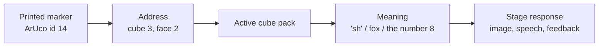

# Sage Stage — Tangible Cubes

**Status:** Concept design — working prototype in [`sage-cubes-widget/`](../sage-cubes-widget/index.html); nothing scheduled into the app
**Companion documents:** [Camera Hub & camera widgets](camera-hub-design.md) · [Maths manipulatives](maths-manipulatives-top10.md) · [App review checklist](app-review-checklist.md)
**Date:** 2026-07-22
**Depends on:** Camera Hub §3 (shared stream, curtain, health panel) and the ArUco marker detector already committed as a shared module in [camera-hub-design.md §11](camera-hub-design.md)

---

## 1. What this is

A small kit of plain cubes carrying printed fiducial markers, read by the classroom
camera, through which children compose meaning on a table and watch the Stage respond.

The framing that matters: **this is not an AR accessory and not a separate
application.** It is a Sage Stage *input mode* — an alternative to the mouse and the
touchscreen for children who cannot yet read a menu. The Stage supplies the imagination;
the cubes supply the hands.

The lineage is Guubes, which demonstrated the mechanic well: one cube summons an object,
turning it selects among six alternatives, several cubes read as a collection or
sequence, and the shared display becomes a "magic mirror" in which children see their
own physical work inside the learning world. What Guubes appears to have fixed in
firmware — *marker A means bird A* — is the one thing this design makes fluid.

---

## 2. The two gates

These are constraints, not preferences. Both came out of classroom observation, and a
proposed cube activity that fails either one should be cut rather than softened.

### 2.1 The small-world-toy gate

> *If I were observing the lesson, I would ask why physical characters were not used
> with role play.*

A wooden fox, a puppet and a play mat already do open-ended small-world storytelling
extremely well — with no markers, no lighting conditions, no camera and no failure mode.
Any cube activity that a box of small-world toys would do **better** is a downgrade
dressed as innovation: slower, more fragile, and it inserts a screen between the child
and the play. An observer spots it immediately.

So a cube activity must earn its place on at least one of three grounds, none of which
a physical toy can meet:

1. **Identity is reconfigurable.** A wooden fox is always a fox. Cube 3 is a fox on
   Monday, the digraph *sh* on Tuesday and the number 8 on Wednesday. One kit, no
   reprinting, no cupboard full of themed sets.
2. **The work is legible to the room.** Six children with toys produce private play.
   Six cubes produce an arrangement the Stage can read, enlarge, narrate and record —
   so the rest of the class sees it, and the teacher gets evidence without hovering.
3. **It answers back.** Small-world play cannot tell a child their sequence is now in
   order, or that their sentence reads correctly.

Where none of the three applies, the honest answer is *use the toys*.

### 2.2 The tempo rule

Children take time to find the right cube and the right face. That time is not dead
time — it is searching, choosing and negotiating — but it makes the kit **useless for
anything synchronised or timed**, and pretending otherwise degrades the learning into a
scramble.

Therefore:

- **No countdowns, no timers, no races, no "show me your cubes — 3… 2… 1…".**
- **No whole-class simultaneity.** This is a small-group and table activity that the
  Stage makes visible to the room, not an activity the whole room performs at once.
- Composition is deliberate and revisable. A child may take a minute over one cube.

This is worth stating explicitly because Cubes and **Class Vote cards**
([camera-hub-design.md §10](camera-hub-design.md)) share a detector but sit at opposite
ends of the tempo scale, and the temptation to reuse Class Vote's countdown UX will be
strong.

| | Class Vote cards | Tangible Cubes |
|---|---|---|
| Participants | Whole class, thirty at once | Small group, two to six |
| Tempo | One synchronised moment, ~3 s | Sustained, unhurried, minutes |
| Input channel | Card ID + **rotation** | Marker ID (**rotation ignored**) — §7 |
| Output | A tally | A composition |
| Failure if rushed | None; rushing is the point | Total; rushing destroys it |

Same shared module, opposite interaction design.

---

## 3. Key stage positioning

Gate 2.1 and the tempo rule together determine who this is actually for. The answer is
narrower than the concept's enthusiasm suggests, and being honest about it protects the
feature.

**EYFS (Nursery and Reception) — continuous provision, not carpet time.**
Children of this age cannot collaboratively locate and present six specific faces to a
camera at any useful pace. As a whole-class activity it would look — correctly — like
technology getting in the way of play. It belongs in **continuous provision**: a
provocation at a table, a small group of two or three, an adult nearby, no time
pressure, the Stage responding to whatever they do. Even there it must pass the
small-world-toy gate, which in practice means EYFS use is limited to activities relying
on **reconfigurable identity** or on **the Stage answering back** — a cube that becomes
a different animal each session, or a count that confirms itself. For pure imaginative
role play, use the toys.

**Key Stage 1 (Years 1 and 2) — the primary target.**
Children can reliably find a labelled face, hold it to the camera, and reason about
left-to-right order. This is where phoneme blending, sentence construction, number bonds
and sequencing all land naturally, and where "compose the answer" beats "pick the answer"
most clearly. **Design for Year 1 first**; treat everything else as an extension.

**Key Stage 2 — selective and occasional.**
Older children can do more with the kit (equations, fractions, variables, food chains),
but they can also read, type and use a mouse — so the cubes must justify themselves
against a plain widget every time. Good fits are collaborative and physical: a group
building an equation together at a table, cause-and-effect timelines, tangible
programming. Bad fits are anything one child could do faster alone on screen.

---

## 4. The core idea — the marker is an address, not the content

Each printed marker resolves to a **`(cube, face)` address**. Nothing about the meaning
of that address is baked into the print. The Stage's currently loaded **cube pack**
(§5) decides what `cube 3, face 2` means for this activity, this lesson, this class.

The consequence is the whole argument for building this: **the physical kit stays
constant while the learning world is infinitely reconfigurable.** A teacher never
reprints to change topic. A cube can change role between rounds. The prototype already
implements the addressing — `markerIdFor(cubeId, face) => cubeId * 6 + face`
([index.html:1305](../sage-cubes-widget/index.html:1305)) — giving 36 markers for a
six-cube kit.

---

## 5. Cube packs

A **cube pack** is the authored data that gives an address its meaning: Glenn's
*"packages of themes to be used with the widget."* This is the single change that
separates the concept from reviving a gimmick, and it is architecturally small — the
prototype's hardcoded `modes` object ([index.html:1212](../sage-cubes-widget/index.html:1212))
becomes loadable content rather than code.

A pack declares:

- **Identity and provenance** — name, key stage, subject, author (built-in, teacher, or
  Sage-generated).
- **Faces in play** — see §5.1. A pack need not use all six faces.
- **Per cube:** a role label (*Character*, *Starter*, *Tens*), and per face a
  **child-facing label**, a **display asset** (emoji, bundled illustration or generated
  image) and an optional **spoken form** for narration and phonics.
- **The activity frame** — mode (§9), the prompt, what counts as success in Challenge
  mode, and what Sage should say when it does.

Three sources, in ascending ambition:

1. **Built-in packs** — a small, excellent, hand-made set shipped with the app: phase-2
   phonemes, number bonds to 20, story elements, life cycles. These must be genuinely
   good, because most teachers will never author one.
2. **Teacher-authored packs** — a plain editor: pick a cube, pick a face, type a word,
   choose a picture. Saved with decks, shared as a file.
3. **Sage-generated packs** — *"make the six cubes characters from today's book"*,
   *"number bonds to 20 with gentle hints"*. Sage writes the pack; the teacher reviews
   it before it reaches children. **Never unreviewed** — a generated mapping is content
   in front of a class.

### 5.1 Fewer faces is a feature

Six cubes × six faces is 36 things to hunt through, and hunting is exactly the cost the
tempo rule warns about. A pack therefore declares how many faces are in play, and unused
faces print blank.

- **Year 1 starting point: two or three faces per cube.** Fewer options, faster
  composition, less floundering.
- Faces can be added as children get more capable, without new cubes or a new kit.
- Blank faces are also a safety valve: a cube resting on a blank face is unambiguously
  "not participating."

---

## 6. The physical verbs

The system reads a deliberately small set of dependable signals. Cleverness here is a
trap: an interaction that works 85% of the time reads as *broken* to a five-year-old,
and once the magic breaks the teacher does not come back.

**Committed:**

| Verb | Signal | Prototype status |
|---|---|---|
| **Present / absent** | Which cube addresses are visible | Implemented — `state.detections`, 950 ms decay ([index.html:1332](../sage-cubes-widget/index.html:1332)) |
| **Turn** | Which face of a cube is showing | Implemented — face decoded from marker id |
| **Order** | Left-to-right sequence by marker centre | Implemented — slot-preserving reorder ([index.html:1610](../sage-cubes-widget/index.html:1610)) |
| **Introduce / remove** | A cube entering or leaving the area | Implemented as a consequence of presence |

**Deferred, in rough order of risk:**

- **Proximity** — two cubes close together as a deliberate act. Plausible, but needs a
  distance threshold that survives camera angle and cube size; a later addition.
- **Stacking** — attractive and genuinely expressive, but occlusion-prone and hard to
  distinguish from "one cube in front of another." Treat as research, not roadmap.
- **Gesture, tilt, speed, dwell.** Not until everything above is boringly reliable.

The 950 ms decay window in the prototype is the right instinct and should survive into
production: it means a hand passing over the mat, or a child's sleeve, does not make a
cube vanish from the composition. Likewise the reorder logic fills *existing slots* with
visible cubes rather than rebuilding the sequence, so a briefly hidden cube does not
scramble the line.

---

## 7. What rotation must not mean

**Decision: in-plane rotation carries no meaning. Cube identity and value come from the
marker id alone.**

A child spinning a cube flat on the table — idly, or to see it better, or because it
was placed at an angle — must change nothing. If rotation were a channel, the kit would
appear to change its own answers, and the "it answers back" ground in §2.1 would become
"it lies to you."

This is a **direct divergence from Class Vote cards**, where rotation *is* the answer
channel and the card id is only an identity. Same detector, opposite semantics — which
is precisely why it needs writing down. The prototype already behaves correctly: it
consumes `marker.id` and the corner centroid, and ignores corner orientation.

A second-order consequence: because cubes give up rotation, the only way to add
expressive range is more faces (§5.1) or more cubes — not cleverer reading of the same
face.

---

## 8. The printed face — meaning and marker share the surface

The current prototype prints an ArUco marker plus an administrative label —
*"Cube 1 · Face 1 · Marker 0"* ([index.html:1322](../sage-cubes-widget/index.html:1322)).
A five-year-old cannot find a face by recognising a 6×6 bit pattern, and a Year 1 child
should not have to decode "Cube 4, face 3" either. This single detail would produce
exactly the fumbling that the tempo rule warns about — the kit would fail in the hands
before the computer vision ever got a chance.

**The fix: the child-facing meaning and the machine-facing marker occupy the same
face.** The printed sleeve carries the picture or word the child is looking for, with
the marker set into the layout. The child reads the face; the camera reads the marker;
both from one surface, at the moment the face is turned upward.

Practical requirements for the sleeve template:

- The marker keeps its **full quiet zone** (the white border) — this is what the
  detector needs, and artwork must never crowd it.
- Artwork sits **around** the marker, not over it, and is high-contrast at arm's length.
- Cube and face numbers stay on the sleeve for adult assembly, small and out of the way.
- Print on **matte** stock. Gloss bounces projector light straight back into the lens —
  the same warning Class Vote carries.
- The pack (§5) generates the sleeves, so a new topic is a reprint of paper, not a new
  kit — and pack changes that reuse the same faces need no reprint at all.

Note the tension this creates with §5's *"a cube can change role between rounds without
being reprinted"*: that remains true for **Sage's** understanding, but the *child's*
label is physical. Packs that swap meaning mid-lesson must either keep the printed
label abstract (a coloured shape, a numeral) or accept a reprint.

---

## 9. The three modes

The mode is a property of the pack, and it changes what the Stage does with an
arrangement. Keeping them separate matters: not every piece of play should become a test.

- **Explore** — no correct answer. Children discover what each cube does and what
  happens when cubes meet. The Stage reacts, describes and wonders aloud; it never
  marks. This is the EYFS default and the entry point for any new pack.
- **Challenge** — there is something to solve, sort, sequence or construct. The Stage
  confirms, hints and celebrates. Hints escalate gently and never simply give the
  answer.
- **Create** — children compose a story, scene, pattern or explanation, and the artefact
  is the point. The Stage narrates, asks and captures — the output is saved for the
  teacher, not scored.

---

## 10. Story Stage — the flagship

Six cubes carry *character*, *setting*, *object*, *action*, *feeling* and *complication*.

A child places fox, forest and lost-key in view. The Stage grows a forest, introduces
the fox and places the key in the scene. Turning the feeling cube makes the fox curious,
worried or excited. Moving the key beside another character changes who discovers it.

Sage can then say:

> *"The fox has found a key, but Maya has made him worried. What might the key open?"*

Children continue by manipulating cubes and **talking** — which is the real learning.
Sage narrates their version back, asks a vocabulary question, introduces a phoneme, or
captures the finished story for the teacher's records.

This is the clearest illustration of the §2.1 gate in the concept's favour: the spoken
narration, the class-visible scene and the captured artefact are all things a box of
toys cannot produce. It joins physical play, oral language, narrative structure and AI
in a way a touchscreen genuinely cannot.

---

## 11. Curriculum mapping

Read alongside §3 — everything here is scoped by key stage, and EYFS entries assume
continuous provision rather than whole-class delivery.

**EYFS — small group, unhurried, must beat small-world play**

- Count creatures and arrange groups from fewer to more.
- Match quantities to numerals.
- Sort by colour, habitat, size or initial sound.
- Build and extend repeating patterns.
- Explore emotion by turning a character cube.
- Positional language: above, beside, behind, between.
- Retell a familiar story in sequence.

**KS1 — the primary target**

- Blend phonemes by lining cubes up left to right.
- Construct and physically rearrange sentences.
- Number bonds, missing-number problems, part–whole.
- Compare measures and quantities.
- Sequence life cycles, instructions and historical events.
- Classify animals and materials.
- Build branching stories and simple algorithms.

**KS2 — selective; must beat a plain widget**

- Assemble equations and equivalences.
- Manipulate fractions and place value.
- Construct and transform grammatical patterns.
- Model food chains, circuits and planetary systems.
- Cause-and-effect timelines.
- Cubes as variables, conditions and commands in tangible programming.

---

## 12. Relationships are the point

A projected object should not merely sit on top of its marker. **Relationships between
cubes are worth more than six independent animations** — and this is currently the
largest experiential gap in the prototype, which renders each cube in isolation.

- Characters look toward neighbouring characters; a creature notices the object placed
  beside it.
- Numbers visibly join and split when they are brought together.
- A setting cube washes the whole scene, not its own square.
- Bringing two cubes together produces a *third* thing — cooperation, a compound, a
  blended sound.

And the display should **celebrate collective action**: if two children bring their
cubes together, their objects cooperate; if the group completes a sequence, the whole
scene plays. That gives the activity a social payoff rather than six private responses
sharing a screen — which is also what makes it worth projecting at all.

---

## 13. Reliability and the performance area

The technology is straightforward now; **classroom-grade reliability is the hard part**.
Glare, fingers over markers, poor webcams, distant cubes, mirrored video, low light and
several children moving things at once will each puncture the magic. Sophistication that
works 85% of the time feels broken to a five-year-old.

So the first build is deliberately constrained:

- **A marked performance area** — a printed or fabric mat defining exactly where cubes
  count. Outside the mat is off-stage. This solves framing, distance and "is that cube
  part of the answer?" in one physical object.
- **Large cubes** — roughly 8–10 cm, so the marker is big enough to read across a table
  at webcam resolution.
- **High-contrast markers with generous quiet zones**, matte stock (§8).
- **Presence, face and left-to-right order only** (§6). Nothing else in v1.
- **Overhead or shallow-angle mounting** rather than face-on, so cubes do not occlude
  one another. The Camera Hub's camera-source guidance already favours a mounted phone
  or document camera for tabletop work.
- **Honest state on screen.** *"Seeing 4 of 6 cubes"* — never silently guess a missing
  cube. The prototype's scanner readout already does this and should survive.

If the constrained version works instantly, every time, it will feel magical. Extending
it is easy afterwards; recovering a teacher's trust is not.

---

## 14. The physical kit

Deliberately plain, durable and cheap. **The magic comes from the transformation, not
from electronics inside the object.**

- Soft foam or light wooden cubes, ~8–10 cm, safe to drop and to throw.
- **Replaceable printed sleeves** rather than permanently applied markers — a new topic
  costs paper. This is the mechanism that makes §5 real in the room.
- No batteries, no pairing, no charging, nothing to break or lose.
- A class kit is six cubes; a table set could be three. Kits should be usable in
  parallel by different tables only if the marker sets differ — otherwise two tables'
  cubes are indistinguishable to one camera. (Open question, §18.)

---

## 15. Privacy

The same commitments as every camera widget ([camera-hub-design.md §13](camera-hub-design.md)),
and here they are unusually easy to make honestly:

- Recognition runs **locally**; no video leaves the machine.
- **Nothing is recorded.** Frames are transient; only the derived composition survives.
- **No identification of children.** The camera understands the cubes, not the pupils —
  and unlike most camera activities, faces are genuinely irrelevant to the task, so the
  camera can be aimed at the table rather than at the room.
- The Hub's live-camera indicator and screen curtain apply unchanged.

Aiming at a table rather than at children is a real privacy advantage over the other
camera widgets, and worth saying out loud to school leaders.

---

## 16. Where the prototype stands

[`sage-cubes-widget/index.html`](../sage-cubes-widget/index.html) — a standalone
1,755-line page with js-aruco vendored (`aruco.js`, `cv.js`, `ARUCO-LICENSE.txt`). It is
a real detector, not a mock.

**Already working:**

- ArUco detection via `AR.Detector({ dictionaryName: "ARUCO", maxHammingDistance: 2 })`
  ([index.html:1303](../sage-cubes-widget/index.html:1303)).
- The full address scheme and print-sheet generation from the same dictionary that
  decodes.
- All four committed physical verbs (§6), with the 950 ms decay and slot-preserving
  reorder.
- A **simulator fallback** — drag and turn cubes with no camera — which is the right
  call for design work and demos, and should survive into the widget.
- Three activities (Story Stage, Sort & Count, Sentence Lab), a mirror toggle and a
  live scanner readout.

**Gaps against this document, in priority order:**

1. **Meaning is hardcoded.** The `modes` object
   ([index.html:1212](../sage-cubes-widget/index.html:1212)) is exactly the *marker A
   means bird A* limitation this design exists to remove. Cube packs (§5) are the fix.
2. **Print sheets are unusable by children** — marker plus admin label only (§8).
3. **No relationships between cubes** (§12) — six independent renders.
4. **No mode separation** (§9); every activity is implicitly Challenge, and both
   Sort & Count and Sentence Lab mark the child.
5. **`Sort & Count` can generate duplicate values.** Faces come from
   `((value + n + face - 1) % 6) + 1` ([index.html:1244](../sage-cubes-widget/index.html:1244)),
   so two cubes can show the same number; the ordering check uses `<=`
   ([index.html:1421](../sage-cubes-widget/index.html:1421)) so ties pass. Defensible in
   a demo, wrong in a maths activity — a pack must be able to guarantee distinct values.
6. **`Sentence Lab` accepts exactly one arrangement** — a fixed role order
   ([index.html:1438](../sage-cubes-widget/index.html:1438)) — so grammatically valid
   alternatives are marked wrong.
7. **Standalone, not a widget** — own camera handling, outside the Camera Hub.

---

## 17. Build order and spikes

Sequenced so that each step de-risks the next, and so that nothing is built before the
detector it depends on is proven in a real classroom.

1. **Class Vote cards first** — already the promoted first camera widget
   ([camera-hub-design.md §14](camera-hub-design.md)). It hardens the shared ArUco
   detector, the range and lighting guidance, and the print pipeline, against thirty
   children in a real room. Cubes inherit all of it.
2. **Sleeve spike** (paper only, no code) — print marker-plus-artwork sleeves per §8 and
   test detection at table distance under classroom lighting, on matte and gloss, with
   fingers partly covering. Cheap, and it can invalidate §8 in an afternoon.
3. **Cube pack format** — lift `modes` into data, load built-in packs, prove one pack
   swap without touching code.
4. **Performance-area spike** — mat, six large cubes, overhead-ish camera, presence and
   order only. The single question: does it work *instantly, every time*?
5. **Widget on the Camera Hub** — migrate off standalone `getUserMedia` onto the shared
   stream, honour the curtain and indicator, land in the Camera category.
6. **Story Stage** with relationships (§12) and Sage narration.
7. **Pack authoring**, then Sage-generated packs with mandatory teacher review.

Steps 2 and 4 are **kill gates**, not milestones. If the sleeve does not read reliably,
or the mat setup does not work first time in a real room, this concept stops — and that
is a good outcome for a day's work in paper.

---

## 18. Open questions

- **Two tables at once.** Two kits in one camera view are indistinguishable unless their
  marker ranges differ. Ship kits with distinct ranges (cube 1–6, cube 7–12), or accept
  one active kit per camera?
- **How many cubes?** Six is inherited from Guubes and from the prototype. Year 1 may do
  better with three or four; the mat and the pack format should not assume six.
- **Where does the marker range end?** 36 markers per kit is already most of a small
  ArUco dictionary; multi-kit and multi-table use may force a larger dictionary, which
  costs detection distance.
- **Speech.** Story Stage assumes children talk and Sage responds. Is that local speech
  recognition, push-to-talk, or teacher-relayed? This is a much larger dependency than
  the vision implies and may not be v1.
- **Capture format.** What does a saved Story Stage artefact actually look like in a
  deck — a still, a transcript, a replayable sequence of arrangements?
- **Does the mat need calibration?** A printed mat with corner markers would give
  homography for free (the Hub's shared module), enabling true positional language
  (*behind*, *between*) rather than left-to-right order alone. Worth prototyping at
  step 4.
- **Blank-face handling.** Is a cube resting on a blank face "absent", or "present but
  silent"? These read differently to a child.
